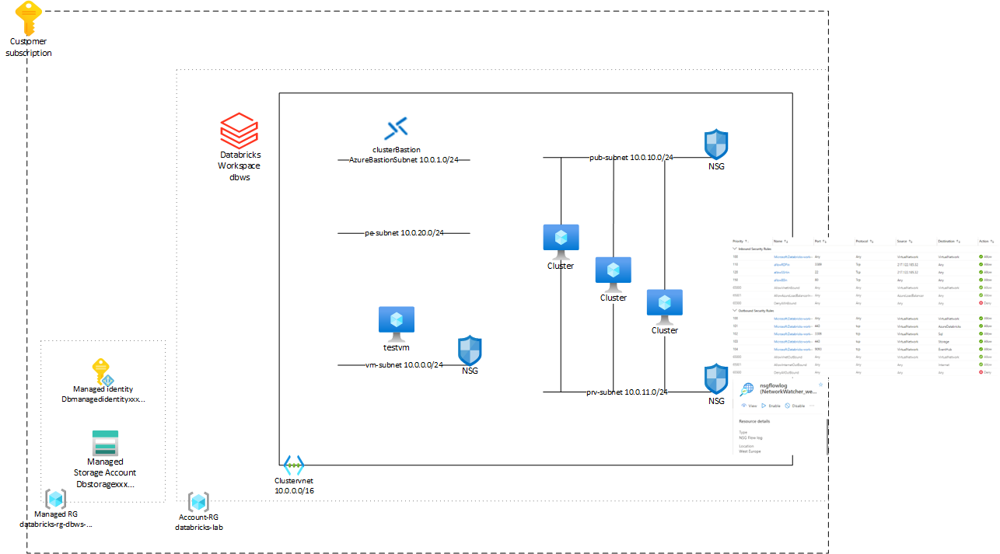

# Databricks Lab

A lab environment for network experimentation with Azure Databricks.

## Deployment
Log in to Azure Cloud Shell at https://shell.azure.com/ and select Bash.

Ensure Azure CLI and extensions are up to date:
  
`az upgrade --yes`
  
If necessary select your target subscription:
  
`az account set --subscription <Name or ID of subscription>`
  
Clone the  GitHub repository:
  
`git clone https://github.com/mddazure/databricks-lab`
  
Change directory:
  
`cd ./databricks-lab`

Deploy the bicep template:

`az deployment sub create --name lab --location westeurope --template-file main.bicep`

## Components

All components are deployed in a single Resource Group named *databricks-lab*, and Databricks adds a managed Resource Group named *databricks-rg-dbws-{unigueid}*

The deployment does not contain a cluster, this is deployed from the Workspace portal.

A general purpose Windows VM named testvm is deployed on separate subnet.

VM Credentials:

adminUsername = AzureAdmin

adminPassword = Databricks-2022